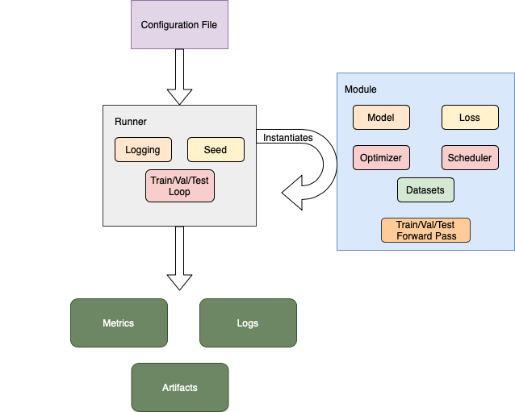
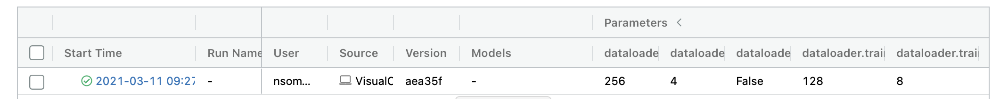
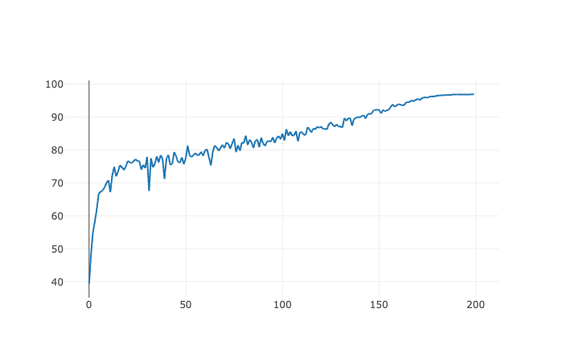

# core-ml

General machine learning testing framework for experimentation.

## General Structure

The goal of this project is to make an easily extensible, and well structured library to for my ML experiments. The system is generally structured as two base classes which capture the main functionality needs. 

1. A Module class which contains the functionality for the actual "doing". The optimizer is contained here, the model, the scheduler and any other functionality which is performing some action in the ML problem.
2. A Runner class which contains the functionality for the orchestrator of the module class. The runner calls different functions from the module to define the workflow of the problem. For example the runner's main function is the entry point and it calls a training iteration or testing iteration of the underlying module. It also contains logging, random seed and some setup and teardown functionality.

A diagram of the generic structure is shown below,



## Example Functionality

### Standard Visual Classification

Since the experiments are driven by configuration files, once a dataset and a model had been added running a number of experiments is matter of changing configurations. All of the configuration files are done using Hydra and are located in the conf directory. Lets say that you see a good performing configuration for CIFAR10 online and you want to test it out. You can create the following configuration files

```
conf/dataloader/basic_loader.yaml

train:
  batch_size: 128
  shuffle: True
  num_workers: 8
val:
  batch_size: 256
  shuffle: False
  num_workers: 8
test:
  batch_size: 256
  shuffle: False
  num_workers: 4
```

```
conf/dataset/cifar10.yaml

train:
  _name: cifar10
  root: './data'
  download: True
  split: 0.8
  mode: train
val:
  _name: cifar10
  root: './data'
  download: True
  split: 0.2
  mode: val
test:
  _name: cifar10 
  root: './data'
  download: True
  mode: test
```

```
conf/optimizer/sgd_cifar10.yaml

_name: sgd
lr: 0.1
momentum: 0.9
weight_decay: 5e-4
```

etc. These configuration files provide a good way of running new experiments without changing any code at all. Also for the most part the logic that converts the configs into classes is meant to be as simple as possible with variables starting with "_" being discarded and the rest being passed directly to the underlying class itself.

We can then package all this up into a script and run training. There a number of configuration options that can also be passed to the runner for logging purposes. Logging is currently available both to the command line as well as to mlflow. When we run the associated VisualClassificationRunner via,

```
./scripts/cifar10_local.sh
```

We can see all of the configurations we specified to the current run on mlflow, 



We can also see metrics logged throughout training, like the validation curve below,



## Available Functionality

* Adversarial Examples
* Visual Classification
    * MNIST
    * ImageNet
    * CIFAR10/100
    * etc.
* Domain Generalization
    * PACS
    * VLCS
    * DomainNet
    * OfficeHome

TODO:

- [ ] Generate Sphinx Documentation
- [ ] Flesh Out Functionality
- [ ] Add Examples for All Functionality
- [ ] Finish adding POSE
- [ ] Finish adding Loss Landscape Viz